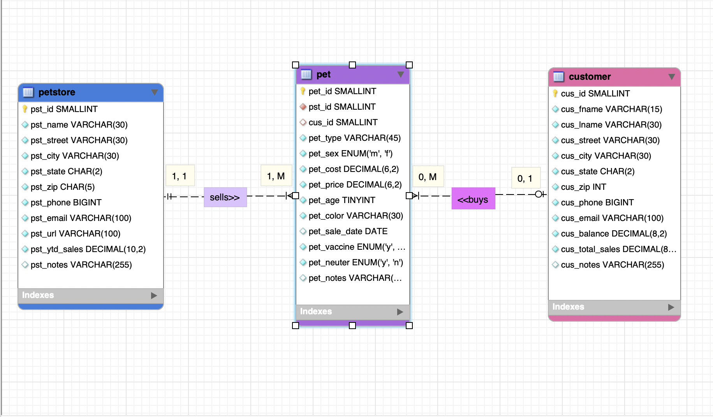
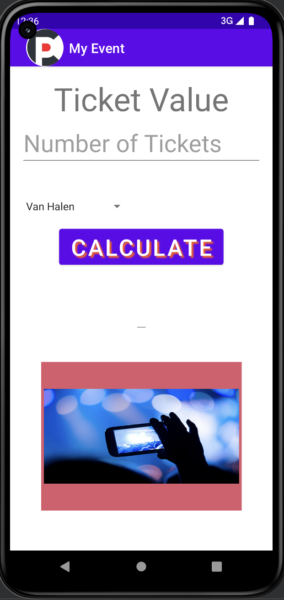
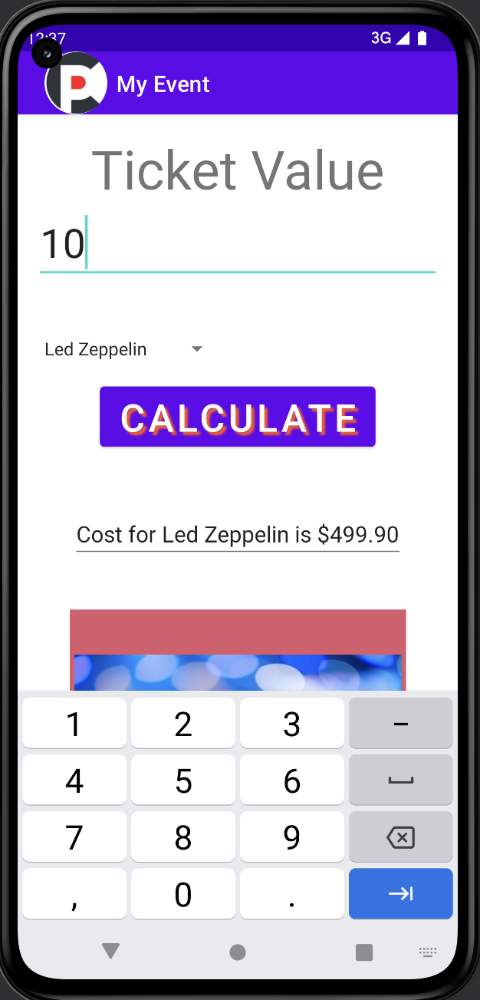
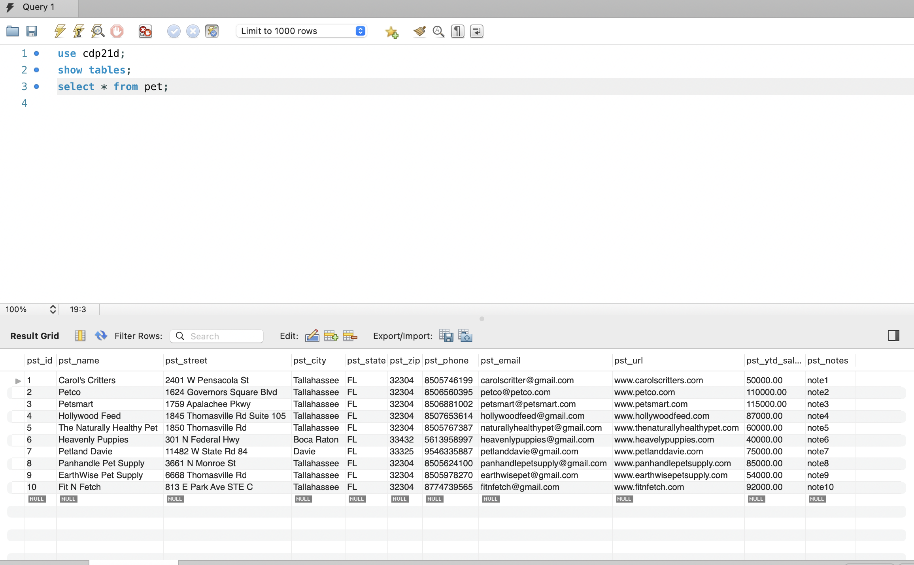
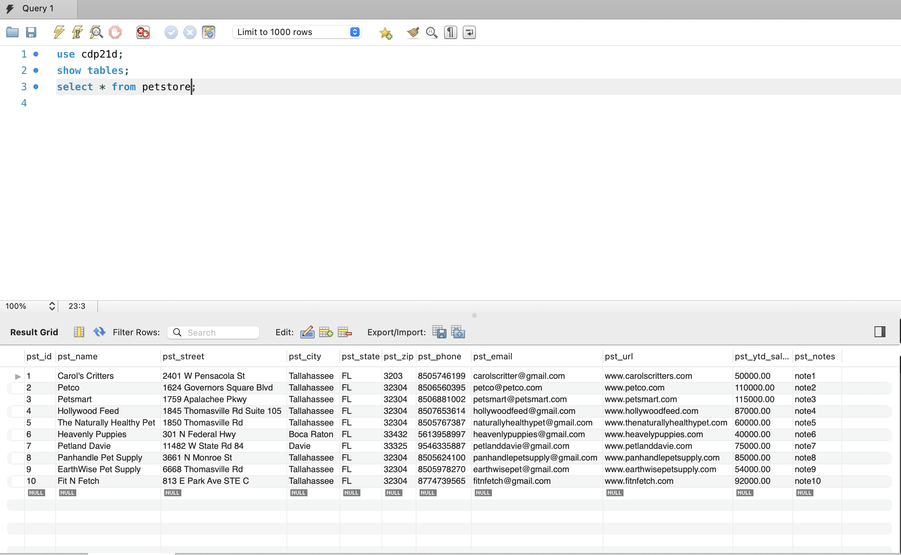
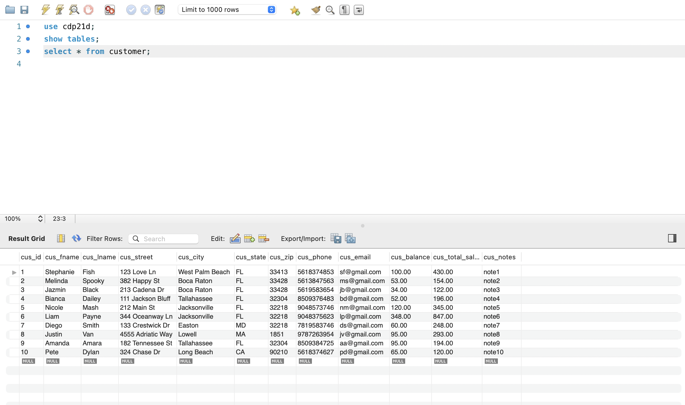
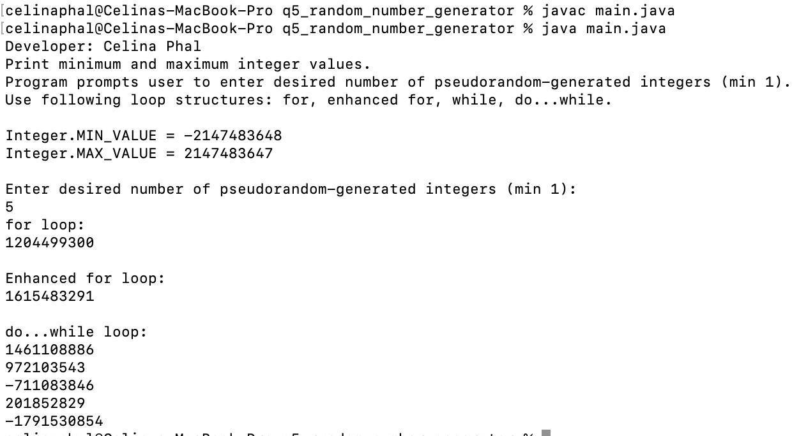
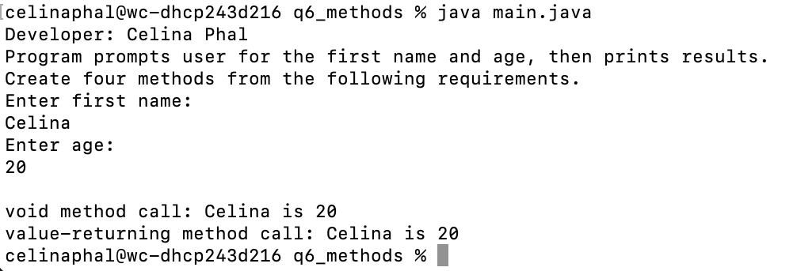

# LIS4381: Mobile App Development

## Celina Phal

#### Assignment 3 Requirements

1. Create MySQL Database based on given instructions.
2. Provide screenshots of completed ERD.
3. Create My Event app. 
4. Provide screenshots of application's opening interface and processing input.
3. Screenshots of skillsets 4-6.

#### Screenshot of ERD:

|   Screenshot of running application's opening user interface.     |  | Screenshot of running application processing user input.
| ----------- | ----------- |
|       |        |

#### Screenshot of 10 Records from each table

| *Screenshot of Skillset 4*      | *Screenshot of Skillset 5*: | *Screenshot of Skillset 6*:     |
| :----:       |    :----:   |          :----: |
|    |  |  |
