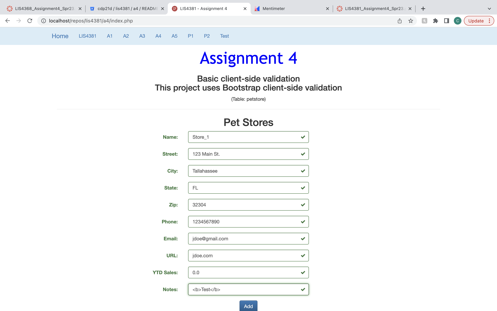
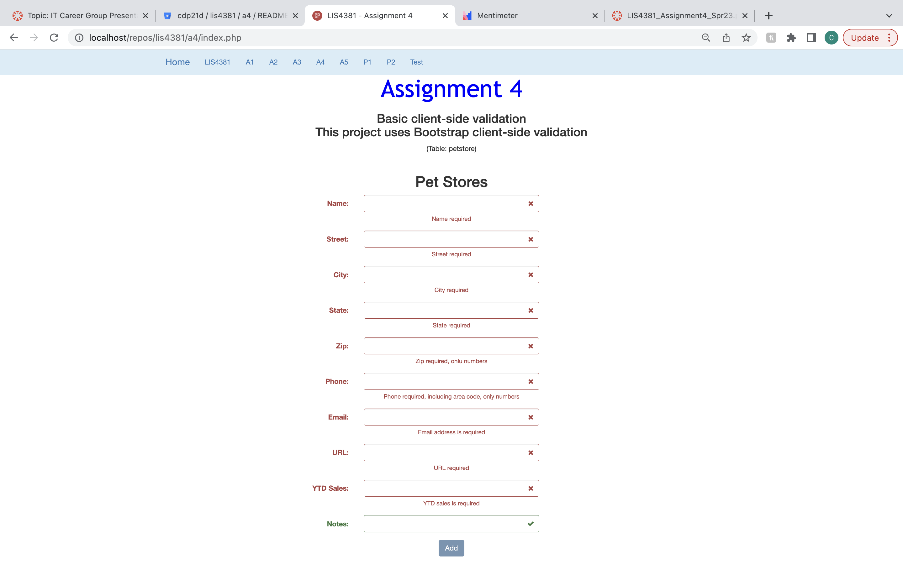

# LIS4381: Mobile App Development

## Celina Phal

#### Assignment 4 Requirements

1. Create basic client-side validation.
2. Provide screenshots passed and failed validation.
3. Screenshots of skillsets 10-12.

### Passed Validation

### Failed Validation

| *Screenshot of Skillset 10*      | *Screenshot of Skillset 11*: | *Screenshot of Skillset 12*:     |
| :----:       |    :----:   |          :----: |
|    |  |  |
