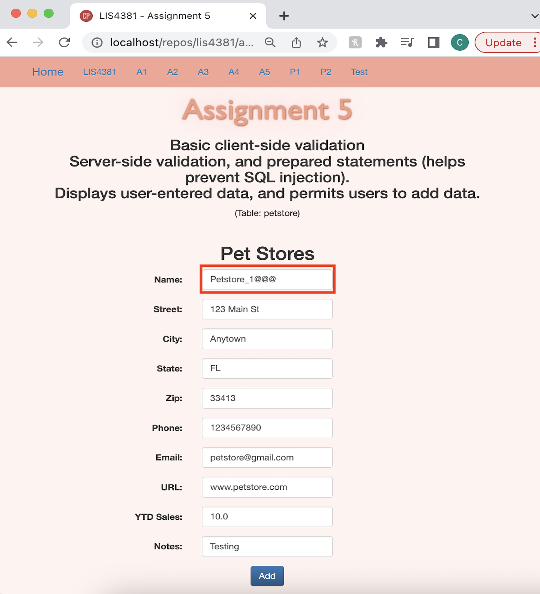

# LIS4381: Mobile App Development

## Celina Phal

#### Assignment 5 Requirements

1. Connect database and add server-side validation.
2. Provide screenshot of invalid data in add_petstore.php file.
3. Provide screenshot of failed validation error message.
4. Provide screenshots of valid data and passed validation.
5. Screenshots of skillsets 13-15.

### index.php

| *add_petstore.php (Invalid)*      | *add_petstore_process.php (Failed Validation)*: | 
| :----:       |    :----:   |
|    |  |

| *add_petstore.php (valid)*:      | *add_petstore_process.php*: | 
| :----:       |    :----:   |
|    |  |

### Screenshot of skillset 13.

### Skillset 14: Simple Calculator
| *index.php*:      | *process_functions.php*: | 
| :----:       |    :----:   |
|    |  |

| *index.php*:      | *process_functions.php*: | 
| :----:       |    :----:   |
|    |  |

### Skillset 15: Write/Read File

| *index.php*:      | *process.php*: | 
| :----:       |    :----:   |
|    |  |

