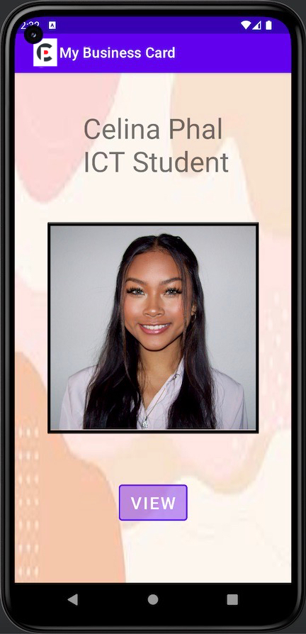

# LIS4381: Mobile App Development

## Celina Phal

#### Project 1 Requirements

1. Create My Business Card App.
2. Provide screenshots of completed app.
3. Screenshots of skillsets 7-9.

|   My Business Card App    |  |
| ----------- | ----------- |
|       |        |

| *Screenshot of Skillset 7*      | *Screenshot of Skillset 8*: | *Screenshot of Skillset 9*:     |
| :----:       |    :----:   |          :----: |
|    |  |  |
